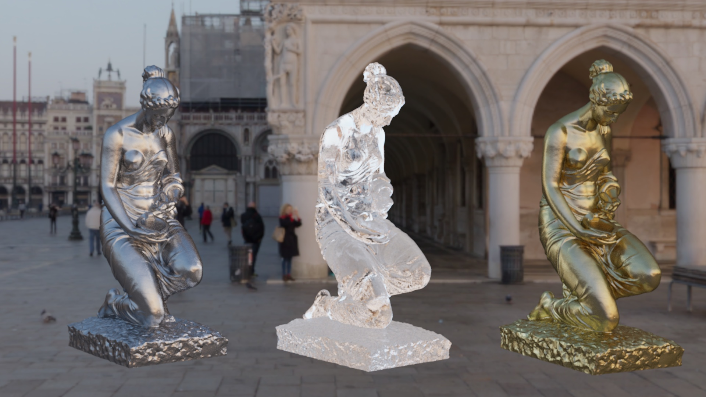
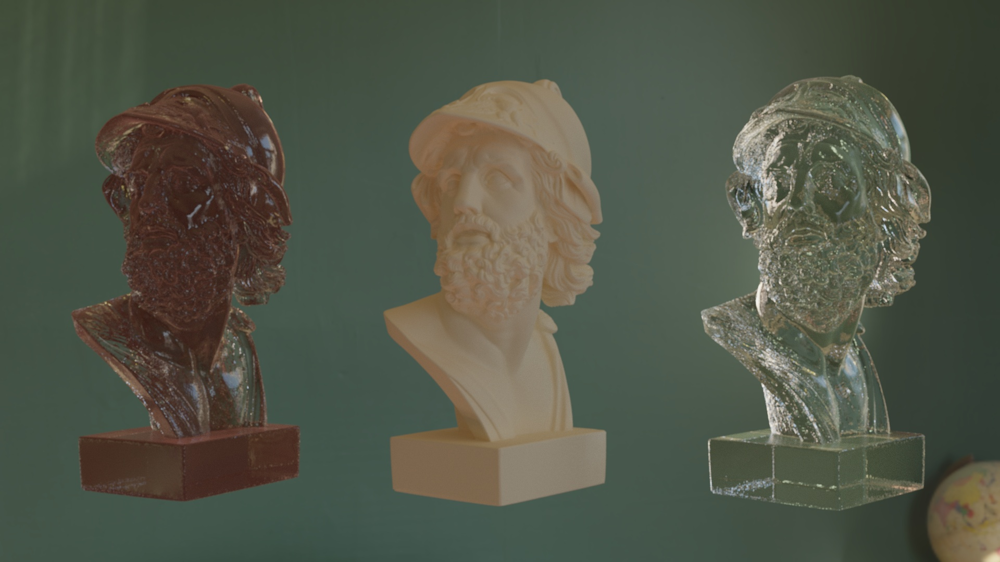

# Path Tracer Metal (v1.0)

A physically based, progressive path tracer for **macOS + Apple Silicon**, written in C++ and Metal.  
It started as a *“Ray Tracing in One Weekend”* clone and evolved into a small production renderer with:

- Hardware **ray tracing** (Metal RT) and a **software BVH** reference path tracer
- HDR environment lighting with importance sampling and MIS
- Extended material models (plastic, subsurface, car paint)
- Intel® Open Image Denoise integration
- Headless CLI rendering and golden-image testing

> This README describes the **v1.0 public release** of the Metal path tracer core.  
> Heavy assets (statues, high-res HDRIs) are provided as a separate download.

---

## Features

### Rendering & performance

- **Progressive path tracing** with temporal accumulation
- **Dual backends**:
  - **Hardware Ray Tracing (HWRT)** using Metal’s ray tracing API (TLAS/BLAS)
  - **Software Ray Tracing (SWRT)** using a CPU-built BVH (tinybvh-style) and compute kernels
- **Configurable path depth** and Russian Roulette termination
- **Internal render scale** (0.5×–2.0×) for trading quality vs performance
- Accurate **environment map sampling** (importance sampling + MIS)

### Materials & lighting

- Physically based material model implemented in `shaders/pathtrace.metal`:
  - Lambertian diffuse
  - Conductor metal with `eta`/`k` and roughness
  - Dielectric glass with IOR, absorption, and coat support
  - Emissive / diffuse light materials
  - **Plastic** with clear coat, tint, and absorption
  - **Subsurface scattering** (random-walk style) for marble/wax/jade-like materials
  - **Car paint** with configurable base layer and flake controls
- Analytic primitives: spheres, rectangles, boxes
- Triangle meshes via OBJ/PLY (powered by tinyobjloader + tinyply)
- HDR environment maps with rotation + intensity overrides

### Denoising & output

- **Intel® Open Image Denoise (OIDN)** 2.3.3 integration
  - AOV path supports a sample-count channel for better denoising
- Multiple tonemappers:
  - Linear, ACES, Reinhard, Hable
- GUI EXR export:
  - **Save EXR…** button in the ImGui “Output / Export” panel
  - Writes a **linear HDR EXR** at internal render resolution
  - Optional multilayer EXR with sample count AOV
- Headless output formats:
  - EXR (linear)
  - PNG (LDR, tonemapped)
  - PFM (HDR float32)
  - PPM (debug/simple)

### Developer tooling

- **Headless renderer** (`PathTracerHeadless`) for batch/offline rendering
- ImGui-based UI overlay:
  - Real-time stats (GPU time, BVH stats, samples/min, backend mode, etc.)
  - Camera + renderer controls
  - Render scale, tonemapping, denoiser toggle, EXR export


## Gallery

<div align="center">

| | |
|:---:|:---:|
|  |  |
|  |  |
|  |  |
|  |  |
|  |  |
|  |  |

</div>

---

### Ray Tracing Acceleration

The path tracer supports two acceleration structures:

**Hardware Ray Tracing** (Apple Silicon):
- Uses Metal's native ray tracing API
- TLAS (top-level) over mesh instances
- BLAS (bottom-level) for triangle meshes
- Automatic BVH construction on GPU
- Lower traversal overhead than software

**Software Ray Tracing** (Fallback):
- Custom BVH with Surface Area Heuristic (SAH) construction
- Linear BVH layout for cache-friendly traversal
- Stack-based traversal with 128-entry stack
- Early exit optimization for shadow rays
- Per-ray statistics: nodes visited, primitive tests, coherency metrics

Real-time statistics displayed in ImGui:
- Average nodes visited per ray
- Average primitive tests per ray
- Shadow ray early exit percentage
- Both-children-visited percentage (traversal coherency)

## Requirements

- **macOS:** 12.0 or later
- **Xcode:** 13.0 or later (for Metal compiler)
- **CMake:** 3.24 or later
- **Apple Silicon:**
  - M3 and later: Hardware ray tracing acceleration enabled
  - M1/M2: Software ray tracing (fallback)
  - **Important** Apple exposes `MTLDevice.supportsRaytracing` even on M1/M2, so the renderer still launches the HWRT pipeline and Metal silently emulates it on the GPU cores. The ImGui stats therefore show “Hardware Ray Tracing” as *active* even though traversal runs in software. Toggle **Software Ray Tracing** in the Settings panel or pass `--enableSoftwareRayTracing=1` if you want to stay on the pure BVH path for debugging or parity.

### Toolchain

- CMake ≥ 3.24
- Xcode / Apple Clang with C++20 and ObjC++

### Dependencies (vendored in `external/`)

- [Dear ImGui](https://github.com/ocornut/imgui)
- [Intel® Open Image Denoise](https://www.openimagedenoise.org) 2.3.3
- [tinybvh](https://github.com/jbikker/tinybvh)
- [tinyobjloader](https://github.com/tinyobjloader/tinyobjloader)
- [tinyply](https://github.com/ddiakopoulos/tinyply)

> **ImGuizmo:** The UI includes optional support for [ImGuizmo](https://github.com/CedricGuillemet/ImGuizmo).
> For v1.0 you can either vendor ImGuizmo into `external/ImGuizmo` or disable its use via a CMake option (see "Known limitations" below).

---

## Building

### CMake (Command-line)

```bash
cmake -S . -B build -DCMAKE_BUILD_TYPE=Release
cmake --build build
```

This will produce:
- `build/PathTracer.app` – GUI application
- `build/PathTracerHeadless` – headless CLI renderer
- Shaders and assets copied next to the binaries (via CMake post-build steps)

### Running the GUI

Run the app bundle to watch the progressive path tracer converge:

```bash
open build/PathTracer.app
```

Or (for debugging purposes):

```bash
./build/PathTracer.app/Contents/MacOS/PathTracer
```

### Controls and UI Panels

**Camera:**
- Typical FPS/orbit controls (exact bindings depend on your local setup)

**Settings Panel:**
- Backend: Hardware Ray Tracing vs Software BVH
- Samples per frame
- Max path depth, Russian Roulette toggle
- Denoiser on/off
- Tonemapper (Linear / ACES / Reinhard / Hable)
- Exposure (in stops)

**Output / Export Panel:**
- Save EXR… button
- Saves a linear EXR snapshot of the current accumulation
- Outputs to `./renders/render-YYYYMMDD-HHMMSS.exr` (see limitations)

**Performance Panel:**
- FPS and GPU/CPU timings
- Sample count and samples/min
- BVH statistics (nodes, prims, average nodes/leaf tests per ray)
- Intersection mode label: "Hardware Ray Tracing" vs "Software Ray Tracing"

## Headless CLI Rendering

For offline renders without a GUI, use the `PathTracerHeadless` CLI:

```bash
build/PathTracerHeadless --scene=hygieia-other --enableSoftwareRayTracing=1 \
    --width=1920 --height=1080 --sppTotal=4096 \
    --output=renders/hygieia.exr
```

**Key flags:**

- `--scene=<id-or-path>` — Required. Scene identifier (from assets) or path to a `.scene` file.
- `--output=<path>` — Output filename. Defaults to `renders/<scene>_<WxH>.<format>`.
- `--width/--height` — Override render resolution (clamped to ≥ 8).
- `--sppTotal` — Total samples to accumulate (default 1024).
- `--maxDepth` — Override maximum path depth.
- `--seed` — Fixed RNG seed (0 = random).
- `--envRotation`, `--envIntensity` — Environment overrides (degrees / multiplier).
- `--enableSoftwareRayTracing[=0|1]` — Force software ray tracing instead of hardware acceleration.
- `--denoiser[=0|1]` — Enable/disable Intel OIDN denoising (default: enabled).
- `--tonemap`, `--exposure` — Override tonemapping/exposure for LDR outputs.
- `--format=<exr|png|pfm|ppm>` — Output format (default EXR, linear HDR).

All overrides apply **after** scene parsing. HDR formats (`exr`, `pfm`) are saved linear.


## Scene Format

Scenes are described with plain-text `.scene` files under `assets/`. Scenes support spheres, rectangles, boxes, and triangle meshes stored as Wavefront OBJ files:

```
camera target=0,0,0 distance=10 yaw=0 pitch=0 vfov=40 defocusAngle=0.6 focusDist=10
renderer samplesPerFrame=8 maxDepth=20 envRotation=30 envIntensity=1.5 enableSoftwareRayTracing=0 width=1920 height=1080

background env=assets/HDR/studio.hdr

material type=metal albedo=0.9,0.9,0.9 fuzz=0.05
material type=diffuse_light albedo=5,5,5
mesh path=models/dragon.obj material=0 translate=0,0,0 scale=1,1,1 rotate=0,180,0
sphere center=0,-1001,0 radius=1000 material=1
```

**Geometry Types**:
- `sphere center=X,Y,Z radius=R material=INDEX`
- `rectangle axis=MIN,MAX perpendicular=VALUE offset=MIN,MAX material=INDEX`
- `box min=X,Y,Z max=X,Y,Z material=INDEX [translate] [scale] [rotate]`
- `mesh path=FILE material=INDEX [translate] [scale] [rotate]`

**Material Types**:
- `type=lambert` - Matte diffuse
- `type=metal` - Reflective with Fresnel (optional `fuzz`)
- `type=dielectric` - Glass/clear (optional `refractiveIndex`)
- `type=diffuse_light` - Emissive for area lights

**Backgrounds**:
- `background env=path/to/file.hdr` - HDR environment map
- `background solid=R,G,B` - Solid color
- `background gradient=R,G,B` - Sky gradient
- `envRotation` (degrees) and `envIntensity` (multiplier) can be supplied via the `renderer` block to orient and scale the environment map.

**Renderer Overrides**:
- `samplesPerFrame`, `maxDepth`, `tonemap`, `exposure`, `seed`
- `envRotation` (degrees) and `envIntensity` (multiplier)
- `enableSoftwareRayTracing[=0|1]`
- `width` / `height` (clamped to ≥ 8)

OBJ files should provide vertex positions and may include normals/UVs for better shading.

## Release

Latest stable release:  
**Metal Path Tracer v1.0.0 (Apple Silicon)**  
https://github.com/dariopagliaricci/Metal-PathTracer-arm64/releases/tag/v1.0.0

## Assets Pack

The scenes (Hygieia statue, Ajax bust, higher-res HDRIs, detailed dragon meshes) live in a separate asset pack to keep the repo size reasonable:

- Download `Metal-PathTracer-Assets.zip` from the [link provided in the GitHub release](https://drive.google.com/file/d/1fbB77stxZzF48T0oHLZS5FIInNqcGZT2/view?usp=share_link)
- Copy/replace the `assets` folder in the root of the project


## Known limitations (v1.0)

**Hardware vs Software RT parity:**
- For some thin glass / complex topology scenes, HWRT still produces slightly more "frosted" results than the SWRT reference.

**EXR save UX:**
- The ImGui "Save EXR…" button currently:
  - Saves immediately to `./renders/render-YYYYMMDD-HHMMSS.exr`
  - Does not show a native file dialog

**Platform support:**
- Binaries and OIDN libraries in `external/oidn/lib` are built for Apple Silicon (arm64)
- Intel macs and non-macOS platforms are not supported in this configuration

## License

This project is licensed under the MIT License. See the [LICENSE](LICENSE) file for details.

## References

### Core Ray Tracing Foundation
- [Ray Tracing in One Weekend Series](https://raytracing.github.io/) - Peter Shirley
  - Introduces fundamental path tracing concepts and scene format

### Physically-Based Rendering
- [Physically Based Rendering: From Theory to Implementation](https://www.pbr-book.org/) - Matt Pharr, Wenzel Jakob, and Greg Humphreys
  - GGX microfacet BRDF implementation
  - Multiple Importance Sampling (balance heuristic)
  - Environment map importance sampling using alias method
  - Conductor and dielectric Fresnel equations

### Key Papers and Techniques
- **Walter et al. 2007** - "Microfacet Models for Refraction through Rough Surfaces" (EGSR 2007)
  - GGX distribution and Smith masking functions
- **Veach & Guibas 1995** - "Optimally Combining Sampling Techniques for Monte Carlo Rendering" (SIGGRAPH 1995)
  - Multiple Importance Sampling theory and balance heuristic

### Tonemapping Operators
- **Stephen Hill & Krzysztof Narkowicz** - ACES fitted approximation
- **John Hable** - Uncharted 2 tonemap operator (GDC 2010 presentation "Filmic Tonemapping for Real-time Rendering")
- **Erik Reinhard** - Reinhard tone mapping operator

### Dependencies and Libraries
- [Intel Open Image Denoise (OIDN)](https://www.openimagedenoise.org/) - ML-based denoising (Apache 2.0)
- [Dear ImGui](https://github.com/ocornut/imgui) - Immediate mode GUI (MIT)
- [TinyBVH](https://github.com/jacco/tinybvh) - BVH construction (MIT)
- [TinyObjLoader](https://github.com/tinyobjloader/tinyobjloader) - OBJ parsing (MIT)
- [ImGuizmo](https://github.com/CedricGuillemet/ImGuizmo.git) - Collection of dear imgui widgets and more advanced controls.

### Platform
- [Metal Shading Language Specification](https://developer.apple.com/metal/Metal-Shading-Language-Specification.pdf) - Apple
